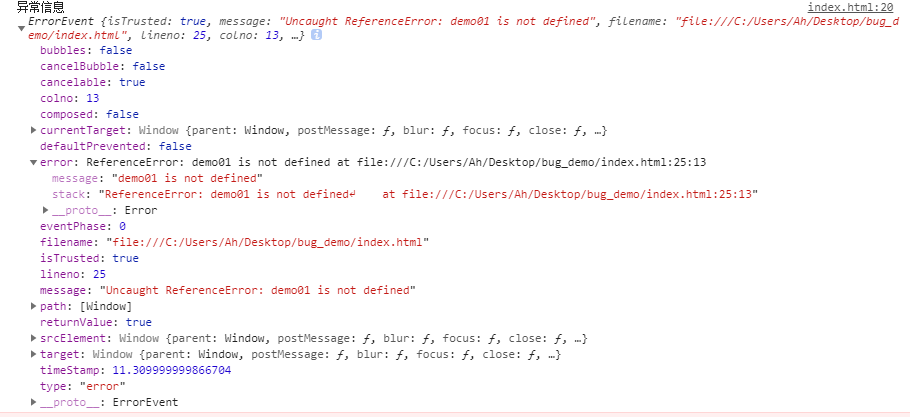
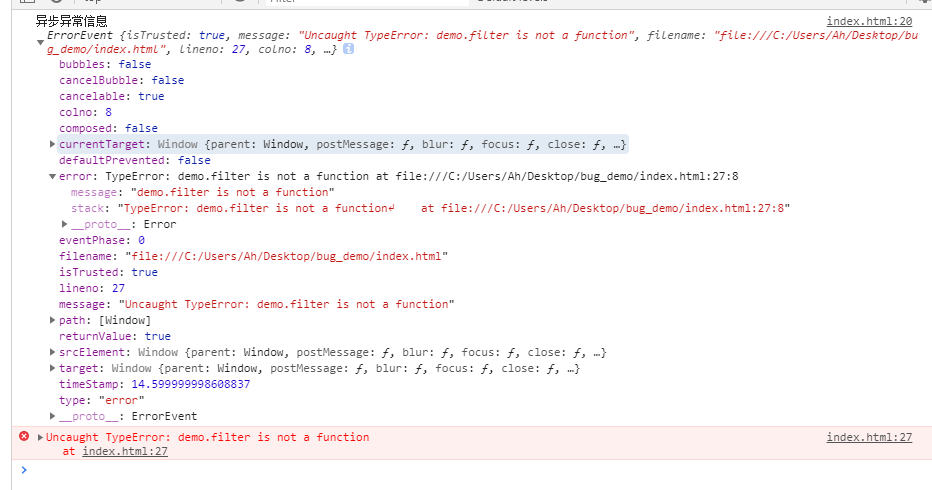
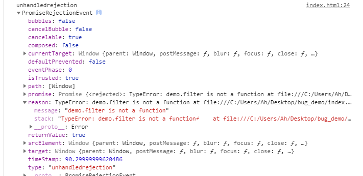

# 采集篇

## 异常类型
1. JS语法错误、代码异常
2. AJAX请求异常
3. 静态资源加载异常
4. Promise异常
5. 跨域 script error

## 异常捕获

```js
try-catch
window.onerror
window.onunhandledrejection
```


## try-catch
try-catch只能捕获同步运行时的错误，对异步的错误却无能为力;

#### 同步异常信息捕获
```js
<script>
try {
  let demo = 'aaaa'
  console.log(demo1)
} catch(e) {
  console.error('异常信息', e)
}
</script>

异常信息 ReferenceError: demo1 is not defined
```

#### 异步异常信息捕获
```js
<script>
try {
  let demo = null
  setTimeout(() => {
    demo.filter(val => val)
  }, 0)
} catch(e) {
  console.error('异常信息', e)
}
</script>

Uncaught TypeError: Cannot read property 'filter' of null
```
明显并没有触发我们的catch代码


## [window.onerror](https://developer.mozilla.org/zh-CN/docs/Web/API/GlobalEventHandlers/onerror)

1. 当JavaScript运行时错误（包括语法错误）发生时，window会触发一个ErrorEvent接口的error事件，并执行window.onerror()。
2. 当一项资源如img或script加载失败，加载资源的元素会触发一个Event接口的error事件，并执行该元素上的onerror()处理函数。这些error事件不会向上冒泡到window，不过（至少在Firefox中）能被单一的window.addEventListener捕获。

::: tip 注意！
1. 在vue等框架中,因异常信息被框架自身所捕获到。所以window.onerror无法捕获
2. 不同的浏览器返回的异常信息不同
3. 建议window.onerror写下项目的最前方，否则可能会导致异常无法捕获
4. window.onerror无法捕获ajax请求异常
5. window.onerror无法捕获Promise异常
:::


#### 同步异常信息捕获
```js
<script>
/**
 * @description: 监听javascript运行异常信息
 * @param {String}  event.message   错误信息字符串
 * @param {String}  event.filename  发生错误脚本的文件
 * @param {Number}  event.lineno    发生错误的行号
 * @param {Number}  event.colno     发生错误的列号
 * @param {Object}  event.error     错误对象
 * @return: 
 */  
window.addEventListener('error', (event) => {
  console.log('异常信息', event)
})


let demo = 'window.onerror'
console.log(demo01)
</script>
```
-----------



#### 异步信息捕获
```js
<script>
/**
 * @description: 监听javascript运行异常信息
 * @param {String}  event.message   错误信息字符串
 * @param {String}  event.filename  发生错误脚本的文件
 * @param {Number}  event.lineno    发生错误的行号
 * @param {Number}  event.colno     发生错误的列号
 * @param {Object}  event.error     错误对象
 * @return: 
 */  
window.addEventListener('error', (event) => {
  console.log('异步异常信息', event)
})


let demo = 'null'

setTimeout(() => {
  demo.filter(val => val)
}, 0)
</script>
```

-----------


## Promise
当我们写了过多的catch时,有可能会忘记而导致Promise出现异常,全局添加[unhandledrejection](https://developer.mozilla.org/en-US/docs/Web/API/Window/unhandledrejection_event)事件监听
```js
<script>
/**
 * @description: 监听promise中异常信息
 * @param {Object}  event.reason     错误对象
 * @return:                          undefined
 */  
window.addEventListener('unhandledrejection', (event) => {
  // 去除控制台异常
  event.preventDefault();

  console.log('unhandledrejection', event)
})

let PromiseDemo = new Promise((resolve, reject) => {
  let demo = 'null'
  let aa = demo.filter(val => val)
  resolve(demo)
})


PromiseDemo.then(val => {
  console.log(val)
})
</script>
```
-----------



## Ajax
[背景知识](https://zh.wikipedia.org/wiki/XMLHttpRequest)

[XMLHttpRequest](https://developer.mozilla.org/zh-CN/docs/Web/API/XMLHttpRequest)

::: tip 注意！
1. 由于 Internet Explorer 7实现了标准的XMLHttpRequest，此功能通过ActiveXObject() 实现。
:::


需要重新定义XMLHttpRequest.send()发送请求方法
```js
<script>
// 此段代码即可实现简单的ajax请求的监听
const XMLHTTPEnd = XMLHttpRequest.prototype.send

XMLHttpRequest.prototype.send = function (xhr) {
  this.onloadend = function (event) {
    if (event.target || event.currentTarget) {
      const {
        responseURL,
        status,
        statusText
      } = event.target || event.currentTarget

      if (status !== 200) {
        console.error('网络请求异常')  
        return true
      }
    } else {
      console.error('网络信息异常')
    }
  }
  XMLHTTPEnd.call(this, xhr)
}
</script>
```
